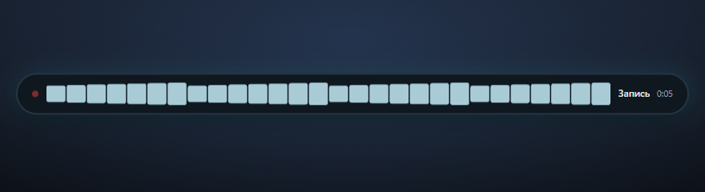

<p align="center">
  
</p>

<h1 align="center">Voxely</h1>

<p align="center">
  Диктовка для Windows. Нажал хоткей, сказал фразу, текст оказался в том окне, где ты работал.
</p>

<p align="center">
  <a href="https://github.com/AryaPaw/voxely/releases"></a>
  <a href="https://github.com/AryaPaw/voxely/actions/workflows/verify.yml"></a>
  
  
  
</p>

<p align="center">
  <a href="#как-пользоваться">Как пользоваться</a>
  &nbsp;|&nbsp;
  <a href="#установка">Установка</a>
  &nbsp;|&nbsp;
  <a href="#приватность">Приватность</a>
  &nbsp;|&nbsp;
  <a href="#для-разработчиков">Разработка</a>
</p>

<p align="center">
  
</p>

## Зачем это

Voxely живёт в трее. Ты пишешь в Cursor, Telegram или Word, жмёшь глобальный хоткей и говоришь. Программа записывает звук, чистит его фильтрами, отправляет в OpenRouter и вставляет расшифровку туда, где ты начал диктовку.

Не надо переключаться в отдельное окно и не надо вручную копировать каждое предложение.

## Как это выглядит

<p align="center">
  
</p>

<p align="center">
  
  &nbsp;
  
</p>

<p align="center">
  
  &nbsp;
  
</p>

## Как пользоваться

1. Положи [API-ключ OpenRouter](https://openrouter.ai/) в **Расшифровка**. Ключ уходит в Windows Credential Manager, не в файл настроек.
2. Кликни в поле, куда нужен текст.
3. Нажми **Ctrl+Shift+Space** (хоткей можно сменить в **Общие**).
4. Говори. Снизу экрана HUD показывает запись и уровень голоса.
5. Нажми хоткей ещё раз, чтобы остановить. Расшифровка вставится в то окно, где ты начал.
6. Наведи на HUD, если нужно **отменить** запись. Escape тоже отменяет.

История хранит расшифровки локально: можно копировать, слушать и искать по тексту.

## Возможности

- Глобальный хоткей и работа из трея, без постоянного окна на переднем плане
- Вставка в исходное окно через Unicode, либо только копирование в буфер, если так удобнее
- HUD записи: волна, таймер, отмена наведением
- Фильтры для речи: срез низов, усиление, шумоподавление, компрессор, лимитер
- Сравнение оригинала и обработанного звука на одной громкости
- Импорт цепочки фильтров из OBS
- История, поиск, хранение на диске с лимитом места и сроком жизни
- Русский и английский интерфейс, светлая, тёмная и системная тема
- Автообновления с подписью Tauri, когда опубликован релиз

## Установка

Нужен **Windows 11 x64**. При первом запуске установщик при необходимости подтянет WebView2.

1. Скачай установщик с [Releases](https://github.com/AryaPaw/voxely/releases).
2. Установи для текущего пользователя.
3. Открой Voxely из меню «Пуск» или из трея.
4. Добавь ключ OpenRouter и проверь соединение.

Модель по умолчанию: `openai/gpt-transcribe`. Список моделей подтягивается из OpenRouter.

Если Windows SmartScreen ругается на первый скачанный файл, это ожидаемо, пока нет Authenticode. Подпись обновлений Tauri при этом своя, отдельная.

## Вставка текста

В **Дополнительно** два режима вставки:

- **В окно (Unicode)** — программа печатает расшифровку в окно, которое было активно в начале записи. Это основной режим.
- **Только буфер обмена** — текст копируется, вставка остаётся за тобой. Ctrl+V программа сама не шлёт.

Некоторые приложения (часть Chromium и редакторов) принимают Unicode хуже других. Если символы не появились, запись всё равно лежит в истории: скопируй оттуда или переключись на буфер.

## Приватность

- API-ключ лежит в Windows Credential Manager, не в git и не в SQLite
- Аудио и история живут в `%APPDATA%\Voxely`
- Расшифровка идёт через OpenRouter: звук уходит к выбранной модели, ключ не светится в логах
- Оверлей не перехватывает фокус и не подменяет чужое окно при вставке

Подробности для аудита: [`docs/SECURITY.md`](docs/SECURITY.md).

## Для разработчиков

Сборка и проверки:

```text
bun install
bun run tauri dev
bun run verify
```

Нужны Bun 1.4+, Rust stable и Visual Studio 2022 Build Tools с C++.

Удобный запуск:

```powershell
.\scripts\dev.ps1
```

Архитектура, релиз и пайплайн звука: [`docs/ARCHITECTURE.md`](docs/ARCHITECTURE.md), [`docs/RELEASE.md`](docs/RELEASE.md), [`docs/OPENROUTER.md`](docs/OPENROUTER.md).

Скриншоты README снимаются с реального UI через мок Tauri:

```text
bunx vite --config scripts/readme-shots/vite.config.ts
```

Лицензия: [AGPL-3.0](LICENSE).
