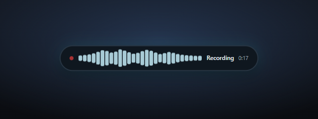
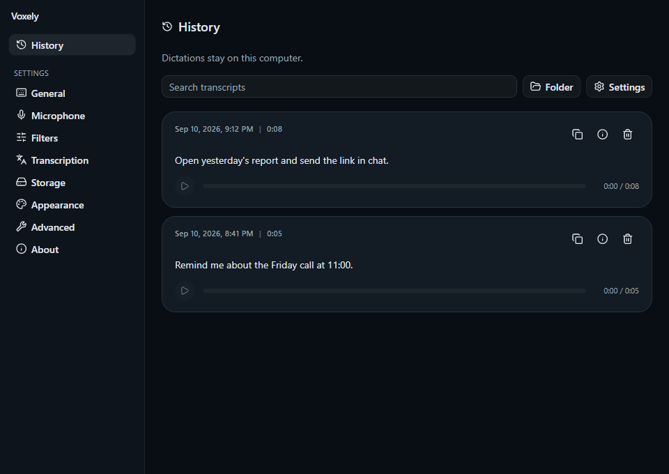
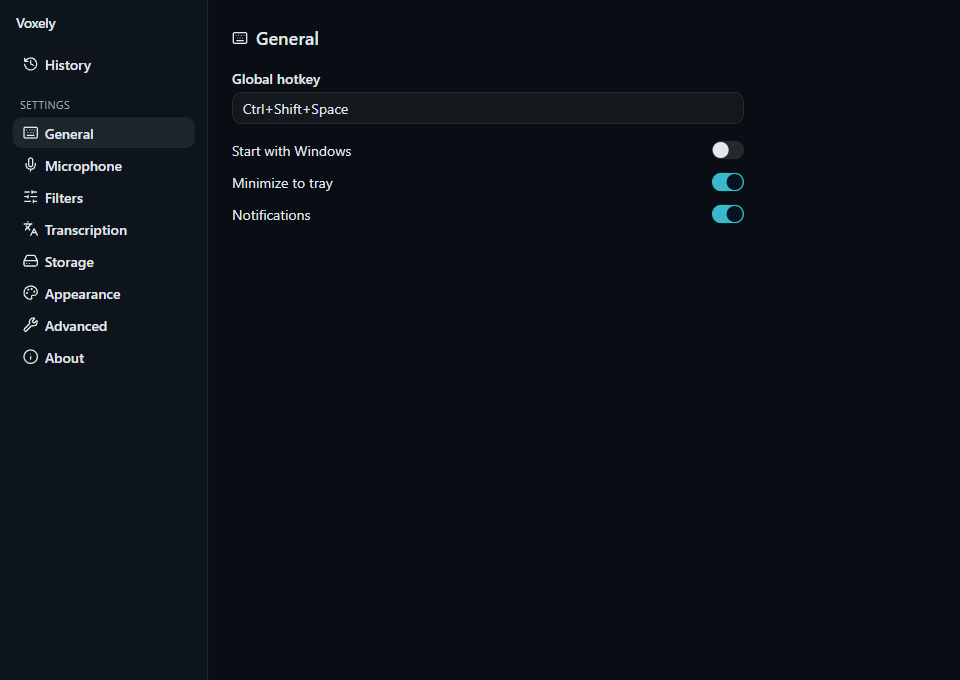
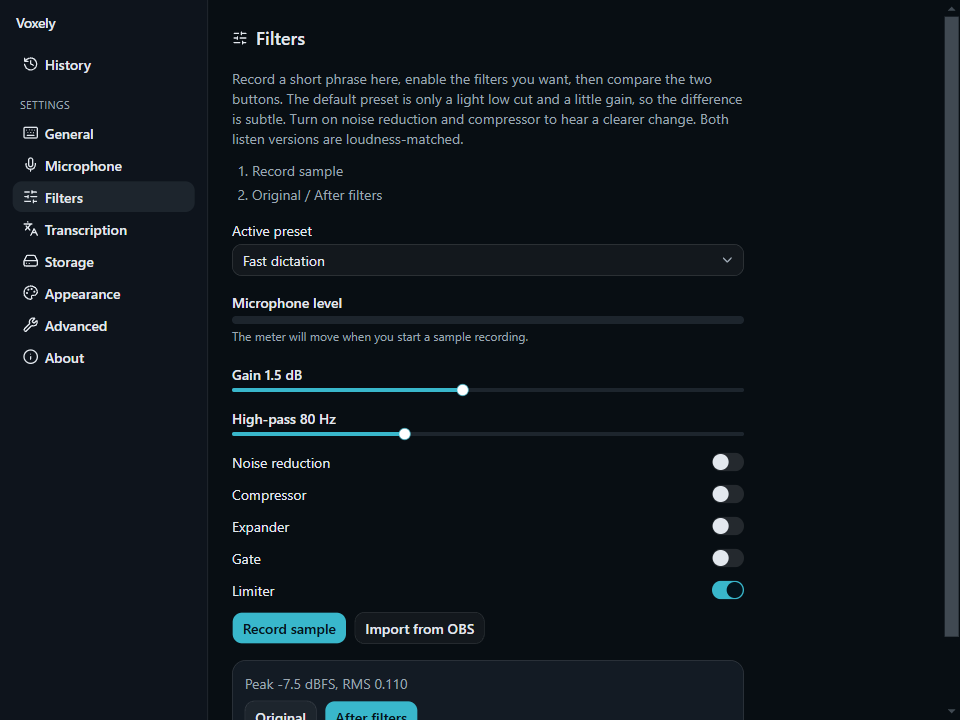
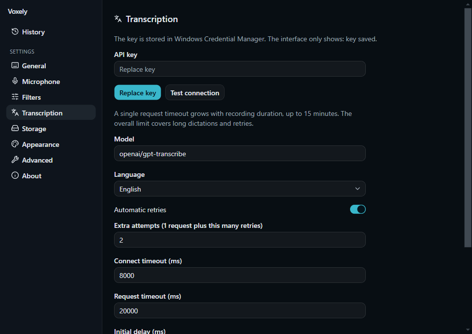
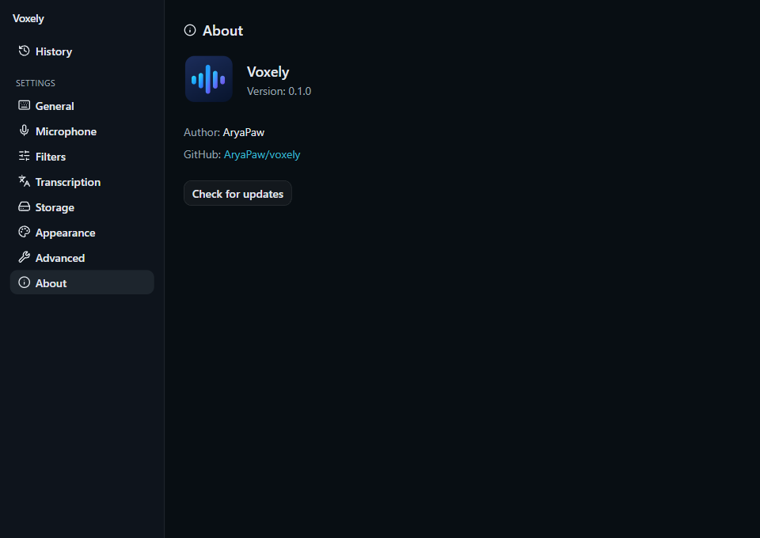

<p align="center">
  
</p>

<h1 align="center">Voxely</h1>

<p align="center">
  Windows dictation. Press the hotkey, speak, and the transcript lands in the window you started in.
</p>

<p align="center">
  <a href="https://github.com/AryaPaw/voxely/releases"></a>
  <a href="https://github.com/AryaPaw/voxely/actions/workflows/verify.yml"></a>
  
  
  
</p>

<p align="center">
  <a href="#how-to-use">How to use</a>
  &nbsp;|&nbsp;
  <a href="#install">Install</a>
  &nbsp;|&nbsp;
  <a href="#privacy">Privacy</a>
  &nbsp;|&nbsp;
  <a href="#for-developers">Developers</a>
</p>

<p align="center">
  
</p>

## Why Voxely

Voxely lives in the tray. You keep typing in Cursor, Telegram, or Word, press a global hotkey, and speak. It records, runs speech filters, sends audio to OpenRouter, and inserts the transcript into the window where you started.

No extra dictation window. No copying every sentence by hand.

## Screenshots

<p align="center">
  
</p>

<p align="center">
  
  &nbsp;
  
</p>

<p align="center">
  
  &nbsp;
  
</p>

## How to use

1. Put your [OpenRouter API key](https://openrouter.ai/) in **Transcription**. It is stored in Windows Credential Manager, not in the settings file.
2. Click the field where the text should go.
3. Press **Ctrl+Shift+Space** (change this in **General**).
4. Speak. The HUD at the bottom of the screen shows recording and level.
5. Press the hotkey again to stop. The transcript is inserted into the window you started in.
6. Hover the HUD to **cancel**. Escape also cancels.

History keeps transcripts locally so you can copy, listen, and search.

## Features

- Global hotkey and tray-first workflow
- Unicode insert into the captured window, or clipboard-only if you prefer to paste
- Recording HUD: waveform, timer, hover to cancel
- Speech filters: high-pass, gain, noise reduction, compressor, limiter
- A/B listen of original vs processed audio at matched loudness
- Import a filter chain from OBS
- Local history, search, retention, and storage limits
- English and Russian UI, light, dark, and system theme
- Signed Tauri updates once a release is published

## Install

You need **Windows 11 x64**. The installer can fetch WebView2 on first run if it is missing.

1. Download the installer from [Releases](https://github.com/AryaPaw/voxely/releases).
2. Install for the current user.
3. Open Voxely from the Start menu or the tray.
4. Add an OpenRouter key and test the connection.

Default model: `openai/gpt-transcribe`. The model list comes from OpenRouter.

SmartScreen may warn on the first download until Authenticode signing is in place. Tauri updater signatures are separate.

## Text insertion

**Advanced** has two insert modes:

- **Into window (Unicode)** — types the transcript into the window that was focused when you started. This is the default.
- **Clipboard only** — copies the text and does not paste. The app never sends Ctrl+V.

Some Chromium-based apps accept Unicode poorly. If nothing appears, the recording is still in History: copy it there, or switch to clipboard mode.

## Privacy

- The API key stays in Windows Credential Manager, not git or SQLite
- Audio and history live in `%APPDATA%\Voxely`
- Transcription goes through OpenRouter; logs omit the key
- The overlay does not steal focus and will not type into a different app

Audit notes: [`docs/SECURITY.md`](docs/SECURITY.md).

## For developers

```text
bun install
bun run tauri dev
bun run verify
```

Needs Bun 1.4+, Rust stable, and Visual Studio 2022 Build Tools with C++.

```powershell
.\scripts\dev.ps1
```

See [`docs/ARCHITECTURE.md`](docs/ARCHITECTURE.md), [`docs/RELEASE.md`](docs/RELEASE.md), and [`docs/OPENROUTER.md`](docs/OPENROUTER.md).

Refresh README screenshots from the real UI with a Tauri mock:

```text
bun run docs:shots
```

License: [AGPL-3.0](LICENSE).
