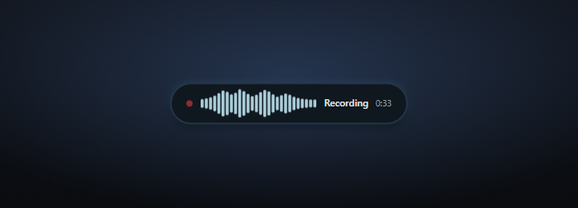
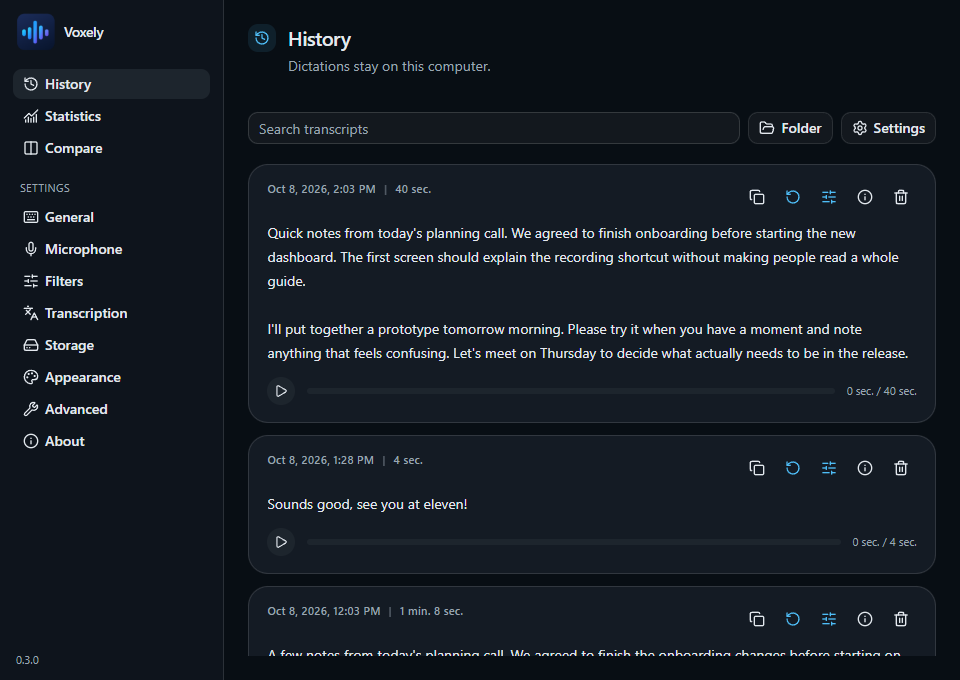
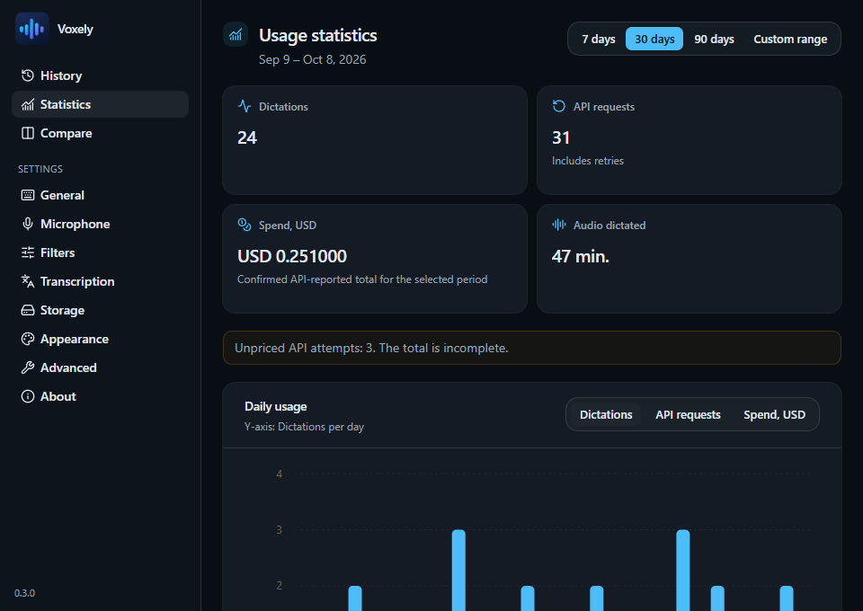
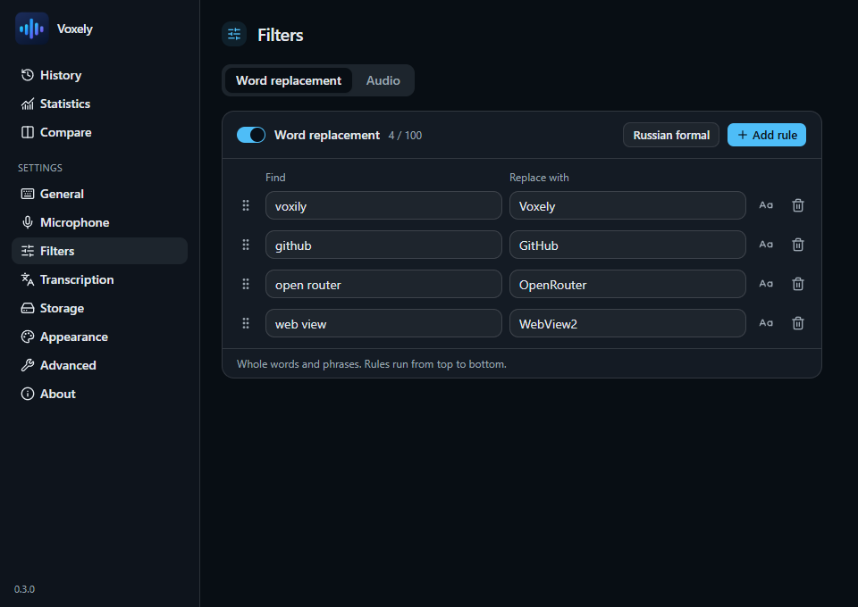
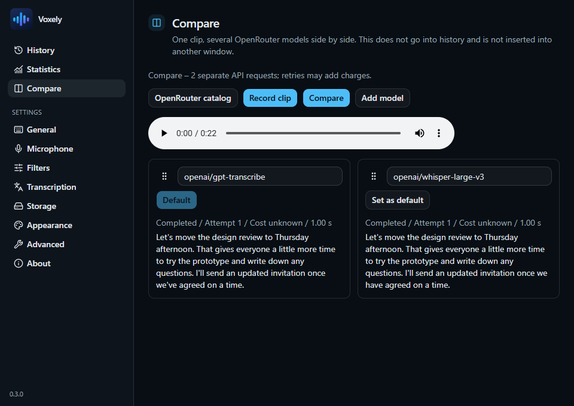

<p align="center">
  
</p>

<h1 align="center">Voxely</h1>

<p align="center">
  Windows dictation. Press the hotkey, speak, and the transcript lands in the window you started in.
</p>

<p align="center">
  <a href="https://github.com/AryaPaw/voxely/releases"></a>
  <a href="https://github.com/microsoft/winget-pkgs/tree/master/manifests/a/AryaPaw/Voxely"></a>
  <a href="https://github.com/AryaPaw/voxely/actions/workflows/verify.yml"></a>
  
  
  
</p>

<p align="center">
  <a href="#install">Install</a>
  &nbsp;|&nbsp;
  <a href="#how-to-use">How to use</a>
  &nbsp;|&nbsp;
  <a href="#privacy">Privacy</a>
  &nbsp;|&nbsp;
  <a href="#for-developers">Developers</a>
</p>

<p align="center">
  
</p>

## Install

Voxely requires **Windows 11 x64**.

### With WinGet

Open PowerShell or Windows Terminal and run:

```powershell
winget install -e --id AryaPaw.Voxely
```

### Download the installer

Alternatively, download the latest installer from [Releases](https://github.com/AryaPaw/voxely/releases) and run it. Voxely installs for the current user; administrator rights are not required.

Open Voxely from the Start menu or tray, add your OpenRouter API key in **Transcription**, and test the connection. The default model is `openai/gpt-transcribe`; the model list comes from OpenRouter.

The installer can download WebView2 if it is missing. SmartScreen may warn on the first download until Authenticode signing is in place; Tauri updater signatures are separate.

## Why Voxely

Voxely lives in the tray. You keep typing in Cursor, Telegram, or Word, press a global hotkey, and speak. It records, runs speech filters, sends audio to OpenRouter, and inserts the transcript into the window where you started.

No extra dictation window. No copying every sentence by hand.

## Screenshots

### Dictation history

Short replies, longer messages, and meeting notes, with search and audio playback.

<p align="center">
  
</p>

### Usage statistics

Daily activity, API requests, and confirmed costs for the selected period.

<p align="center">
  
</p>

### Text replacements

Keep product names and recurring phrases consistent with reusable replacement rules.

<p align="center">
  
</p>

### Model comparison

Compare transcripts from the same recording side by side.

<p align="center">
  
</p>

## How to use

1. Put your [OpenRouter API key](https://openrouter.ai/) in **Transcription**. It is stored in Windows Credential Manager, not in the settings file.
2. Click the field where the text should go.
3. Press **Ctrl+Shift+Space** (change this in **General**).
4. Speak. The HUD at the bottom of the screen shows recording and level.
5. Press the hotkey again to stop. Repeated presses during processing are ignored. The transcript is inserted into the window you started in.
6. Hover the HUD to **cancel**. Escape also cancels.

History keeps transcripts locally so you can copy, listen, and search.

## Features

- Global hotkey and tray-first workflow
- Unicode insert into the captured window, or clipboard-only if you prefer to paste
- Recording HUD: waveform, timer, hover to cancel
- Speech filters: high-pass, gain, noise reduction, compressor, limiter
- A/B listen of original vs processed audio at matched preview loudness (filter-sample playback only)
- Local history, search, retention, and storage limits
- 90-day usage statistics for dictations, API attempts, confirmed USD spend, and audio duration
- English and Russian UI, light, dark, and system theme
- Signed Tauri updates once a release is published

## Text insertion

**Advanced** has two insert modes:

- **Into window (Unicode)** — types the transcript into the window that was focused when you started. This is the default.
- **Clipboard only** — copies the text and does not paste. The app never sends Ctrl+V.

Some Chromium-based apps accept Unicode poorly. If nothing appears, the recording is still in History: copy it there, or switch to clipboard mode.

## Privacy

- The API key stays in Windows Credential Manager, not git or SQLite
- Audio and history live in `%APPDATA%\Voxely`
- Transcription goes through OpenRouter; logs omit the key
- The overlay does not steal focus and will not type into a different app

Audit notes: [`docs/SECURITY.md`](docs/SECURITY.md). Voxely is not a medical device.

## For developers

```text
bun install
bun run tauri dev
bun run verify
```

Needs Bun 1.4+, Rust stable, and Visual Studio 2022 Build Tools with C++.

```powershell
.\scripts\dev.ps1
```

See [`docs/ARCHITECTURE.md`](docs/ARCHITECTURE.md), [`docs/RELEASE.md`](docs/RELEASE.md), [`docs/WINGET.md`](docs/WINGET.md), and [`docs/OPENROUTER.md`](docs/OPENROUTER.md).

README screenshots use the app's React screens with synthetic Tauri fixtures. They don't use local transcripts, usage data, or API keys. Full app screenshots use the default window size from `src-tauri/tauri.conf.json`; the HUD is a separate compact banner. To restore the app's default size, use **Appearance > Reset window size**. Start the fixture UI:

```text
bun run docs:shots
```

In another terminal, capture all full app screenshots with the shared viewport:

```text
npx @playwright/cli -s=voxely-readme open http://127.0.0.1:1425/?section=history --browser=msedge
npx @playwright/cli -s=voxely-readme run-code --filename=scripts/readme-shots/capture.js
npx @playwright/cli -s=voxely-readme close
```

License: [AGPL-3.0](LICENSE).
